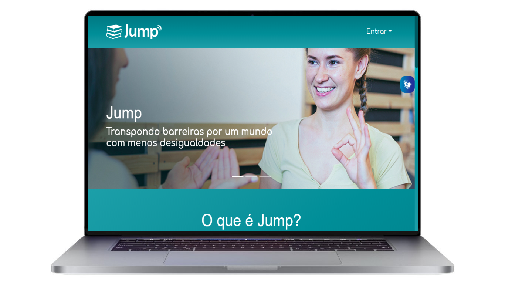

<h1 align="center">
    
</h1>

### Jump Projeto-Recode 

A Jump é uma plataforma de vídeos educativos com acessibilidade para surdos. Aqui você poderá acessar diversos conteúdos com interpretação em LIBRAS.

E você que é intérprete de LIBRAS poderá contribuir com seus vídeos interpretando os conteúdos produzidos por ouvintes.

  

 

### Link Aqui da aplicação:

- [JUMP](http://dgsdev.infinityfreeapp.com/index.php)

## 🚀 Tecnologias

Esse projeto foi desenvolvido com as seguintes tecnologias:

- [HTML](https://www.w3schools.com/html/)
- [CSS](https://cssreference.io//)
- [Javascript](https://developer.mozilla.org/en-US/docs/Web/JavaScript)
- [PHP](https://www.php.net/)

## 💻 Projeto

Jump é uma plataforma onde as pessoas podem, colaborativamente, subir traduções em LIBRAS para vídeos sem acessibilidade de maneira prática e fácil. &#10084;&#65039;

---

## by Squad8 | Jump - Recode Pro 2021

